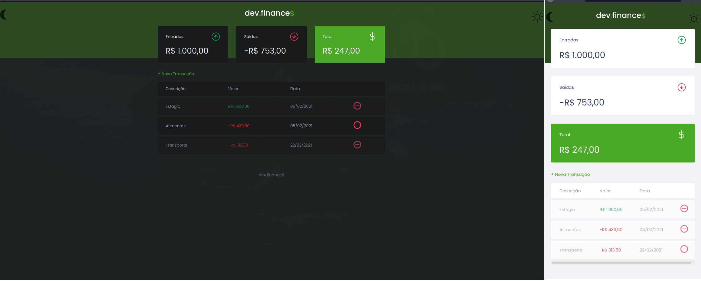

<h1 align="center">
  
</h1>

  <a href="#-tecnologias">Tecnologias</a>&nbsp;&nbsp;&nbsp;|&nbsp;&nbsp;&nbsp;
  <a href="#-projeto">Projeto</a>&nbsp;&nbsp;&nbsp;|&nbsp;&nbsp;&nbsp;
  <a href="#memo-licença">Licença</a>

 

  

 

  

## 🚀 Tecnologias

Esse projeto foi desenvolvido com as seguintes tecnologias:

- HTML
- CSS
- JavaScript

## 💻 Projeto

O dev.finances é uma aplicação de controle financeiro, onde é possível cadastrar e excluir transações, ver o saldo de entrada e saída 💰 é possível também
alterar modo de cor com base na sua preferência. Fiz o deploy da aplicação apenas para conhecimento, ele pode ser encontrado no endereço: https://dev-finances-smk.herokuapp.com/

## :memo: Licença

Esse projeto está sob a licença MIT. Veja o arquivo [LICENSE](LICENSE.md) para mais detalhes.

---

Esse projeto foi desenvolvido pela Rocketseat em na Maratona Discover, eu desenvolvi algumas modificações tendo como base o projeto inicial
